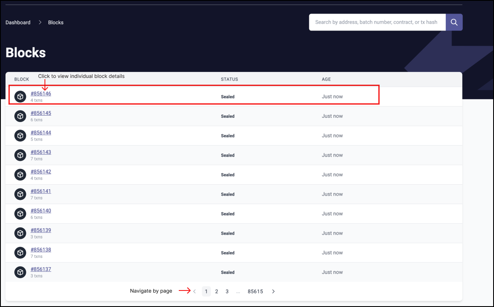

# Browse blocks

The block explorer home screen, by default, displays the 10 most recent blocks in the chain.
View all blocks for a more complete overview of recent blocks, or click on a specific block number for details on that block.
The blocks page is also accessible via the top menu.

## View all blocks

You can click on a block number to see all the details of that specific block. If you want to browse more blocks, click the [Blocks](https://explorer.zksync.io/blocks/) section of the navigation menu. Use the pagination to navigate to the next page.

However, if you have already left the homepage, you can always search for any block by typing in the block number.

There are two main sections inside a block:

1. The Block Header

- This shows brief information about this specific block, as well as a link to the previous block in the chain.

2. Transactions

- Consists of lists of all the transactions that were included in this block.

### Block headers

The following table should help explain what you’ll see in a block.
For more details on blocks, see the docs on [Blocks](../../../dev/developer-guides/transactions/blocks.md).

| Value        | Description                                                                |
| ------------ | -------------------------------------------------------------------------- |
| Block number | The number of the current block. null if pending. [More info on block.number](../../../dev/developer-guides/transactions/blocks.md#block-number-and-timestamp-considerations)    |
| Block size   | The size of the block.                                                     |
| Timestamp    | The UNIX timestamp for when the block was collated. [More info on block.timestamp](../../../dev/developer-guides/transactions/blocks.md#block-number-and-timestamp-considerations)|
| Root hash    | The Cryptographic hash of the block header.                                |
| Status       | The status of the block, could be `sealed`, `included`, `finalized`, or `unfinalized`. |

### Transactions

This section lists all the transactions that are included in this block.
Transactions are served on a first-in-first-out basis, but in the future, we will introduce a "priority heap", which will allow for sorting the transactions.

| Value             | Description                                                                                                                                              |
| ----------------- | ------------------------------------------------------------------------------------------------------------------------------------------------------------------------------ |
| Timestamp         | The block generation time in seconds since the Unix epoch.                                                                                               |
| Hash              | The hash of the transaction serving as the transaction’s ID.                                                                                             |
| From              | The account or smart contract, sending the transaction.                                                                                                  |
| To                | The account or smart contract, the transaction targeted.                                                                                                 |
| Fee               | The rate of fees associated with this transaction processing.                                                                                            |
| Tokens transferred| Details about the tokens(both `to` and `from` addresses) involved in the transactions, it includes, details like the assets, balance in the wallet address, and token address. |
| Contract address  | The rate of fees collected by the network.                                                                                                               |
